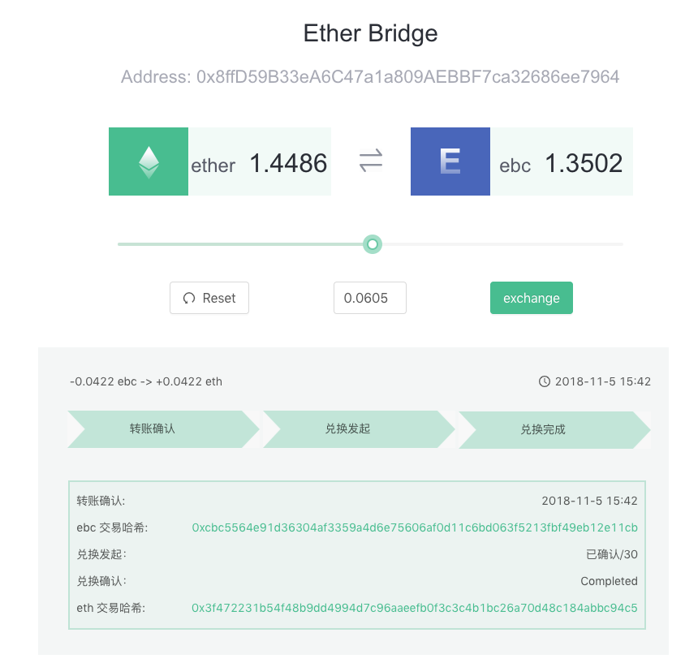

# ether-bridge
This demo is a cross-chain asset transfer gateway. Help users transfer asset from ether to eth bridge coin(ebc).

## Getting Started

### Prerequisites
- [Node.js](https://nodejs.org)
- [Metamask](https://metamask.io/)
- [Neuron Web download address](https://github.com/cryptape/nervos.js/releases)

[Neuron Web](https://github.com/cryptape/nervos.js/tree/develop/packages/neuron-web) is an extension of chrome similar to MetaMask.

To check if node is installed:

```shell
$ node -v
v8.11.4  // version may be different
```

Login your account in Metamask and Neuron Web, and make sure account address in these two extensions are the __SAME ADDRESS__

### Installing

1.Download repo

```shell
git clone https://github.com/cryptape/ether-bridge.git
```

2.Install Dependencies

```shell
yarn install
```

3.Configuration

Create `src/js/config.js`

```shell
cp src/config.js.example src/config.js
```

Set all parameters

```javascript
const config = {
    chain: '', 
    contractAddress: '',
    adminAddress: '', 
    api: '', 
    }
    
module.exports = config

```
`Parameters`

- `chain` - `String`: your chain address
- `contractAddress` - `String`: your contract 
- `adminaddress` - `String`: your admin account address which interact with contract to receive and send ether.
-  `api` - `String`: your back-end api url

4.Start your server

```shell
yarn start
```
Server is running on `http://localhost:3000/` when info below display in your shell.

```shell
Compiled successfully!

You can now view ether-bridge in the browser.

  Local:            http://localhost:3000/
  On Your Network:  http://192.168.10.87:3000/

Note that the development build is not optimized.
To create a production build, use yarn build.

```
Homepage looks like:



## Deploy to server

### 1. Install Dependences

```shell
yarn install
```

### 2. Use webpack generate production version

```shell
yarn build
```

### 3. Pack and rename `build` folder

```shell
ether-bridge > mv build ether-bridge  // rename `build` folder name to `ether-bridge`
ether-bridge > tar -zcvf ether-bridge.tar.gz ether-bridge  // pack `ether-bridge`
```

### 4. Upload ether-bridge.tar.gz to server

```shell
scp ether-bridge.tar.gz user@remote:/tmp  //use your own server address
```

### 5. Login your server

```shell
ssh user@remote //use your own server address
```

### 6. Unpack ether-bridge

```shell
cd /tmp
mv ether-bridge.tar.gz /var/www
cd /var/www
tar -zxvf ether-bridge.tar.gz  // Unpack ether-bridge
```

### 7. Use a static files server, e.g. [NGINX](https://www.nginx.com/) to serve the ether-bridge directory


